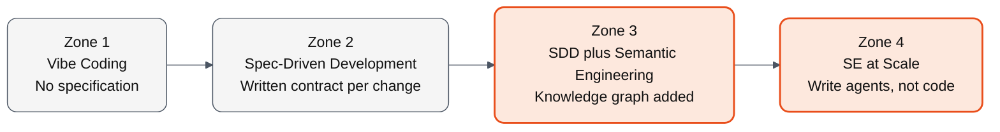

This site documents the methodology we developed at Accion for AI-assisted software delivery, the platform we built to operationalize it, and the operating model we run engagements under.

## The Problem We Set Out to Solve

AI coding assistants do well on small, contained tasks where the change is local and a single prompt can carry the relevant context. On a large enterprise codebase the situation is different.

In large enterprise applications, human developers need to use their tacit knowledge of several external factors such as cross team contracts, design system guidelines, reusable components and libraries available in the enterprise, predefined data models of master data entities, previous technical debt in the architecture, and so on. We also have roles in the enterprise that act as custodians for this additional context - product owners, architects and designers who provide guidance as and when required to the developers. None of this tacit knowledge is visible to an agent, and none of the custodians of the additional context are available for consultation to the agent until we explicitly provide it in some way. Creating large context files would be cumbersome and expensive. We need a more efficient way for agents to be provided only the specific information required for the current task at hand rather than throw the entire enterprise landscape at it.

Bigger context windows and newer models do not change this requirement. The agent needs structured context it can query, not more raw text to wade through.

## How We Solved It

The way we provide that selective context is by building a structured representation of the application that an agent can query for only the parts relevant to the change at hand. We model the application as a knowledge graph across four connected layers: functional (what the system does, typically the domain of the product owner), design (how the software behaves and looks, typically the domain of the designer), architecture (how is the application organized, typically the domain of an architect), and code (what is actually built, across all repositories of the product, stewarded collectively by the engineering team). When a development task is proposed, say in a user story, the agent traverses the graph and pulls only the relevant nodes. Which functional outcomes will be affected. Which design components are touched. Which architectural services and code modules need to change. Which database tables and integration points are in scope. The custodians of the knowledge graph are the four roles that own those domains: the product owner, the architect, the UX designer, and the engineering team. The agent gets the precise context the task at hand requires. After the change is merged, the same traversal verifies that the implementation matches what the spec asked for.

We call the methodology Semantic Engineering. The platform we built to operationalize it is Breeze.AI. The full structural treatment is in [The Methodology](semantic-knowledge-graphs/_index.md).

## How We Arrived At This

Before Gen AI came on the scene, our challenge was to arrive at some standardization and quality control of the critical roles that define the true value of the product - product owners (or business analysts), software architects and experience designers primarily. 

We created a repository of guidelines and templates each role could use, and newer practitioners could be trained against. For product owners it defined persona definitions, outcome specifications, and scenarios. For architects it defined service decompositions, entity definitions, and integration patterns. For UX designers it defined design systems, component libraries, journey maps, and quantitative user metrics. These got ratified and rationalized across multiple product design and development engagements with customers in disparate domains and industries. In 2017, we formalized these guidelines and templates into an internal framework that we called Breeze. The framework has been used for every software engineering engagement of Accion since then. But using it was a lot of manual work. Maintaining the artifacts by hand across hundreds of engagements was the discipline that slipped first under deadline pressure, and we accepted that as a cost of doing business.

Gen AI first came into Accion in Q1 2022, when we were working with a drug discovery application for a pharma leader. What we needed was something better than NLP to parse through extensive text. Transformer models were already available even though Chat GPT was not yet released. They did provide much better context understanding than conventional NLP. But the models were naive and hallucinated extensively, providing decision pathways that did not exist in the validated pharmaceutical research, which made the technology unusable in its early form. We fixed it by building a decision tree of the validated pathways and giving the tree to the model as constrained options, so it could only pick from real pathways rather than invent its own. This methodology did work to provide much better results grounded in the knowledge graph. 

As the foundation models became more proficient, we found that grounding them with a knowledge graph continued to provide more reliable results. Meanwhile, as AI started playing a major role in software engineering, we started evaluating how our Breeze guidelines and templates could be converted into the four graph ontologies, and created custom agents that could populate and query the graph. We named this framework after its 2017 ancestor: Breeze.AI.

While brownfield software engineering projects used the Breeze.AI framework and ontologies, we could further optimize the ontologies for a frequent use case in software engineering - fully automated legacy application modernization, where we only modernize the technology but keep functional parity with the legacy application. Considering the number of clients and organizations who were struggling with this problem, we created another set of agents and ontologies for legacy modernization and called it ASIMOV (**A**gentic **S**oftware **I**ntelligence for **M**igration, **O**ptimization & **V**alidation).

At Accion, we have documented and shared  the entire evolution of Semantic Engineering in our Innovation Summit with customers and partners, and are now practicing it across the board with all customer engagements... or to be more precise, with those customers that allow us to do so.

The full origin story is in [Origins](about/origins.md).

## Where Most Teams Are Today

With the speed at which Gen AI is progressing, and the inevitable hype caused by dramatic media memes and statements by leaders across the technology industry, most teams we talk to seem to lack a clear understanding of exactly how Gen AI can be used. Most of the public material focuses on simple use cases, and the remarkable experience of using a coding agent for the first time is truly a thrill to any software engineer. But little do they realize that while code generation may have got significanly accelerated, dropping the technology into a complex enterprise environment is anything but easy. 

The work that teams take through AI-assisted SDLC falls into four zones of complexity. Each zone is best served by a different zone of process. The same team will use different zones for different work, and most teams have a dominant zone they operate at today.

Most of the work that we see today calls for Zone 1 or Zone 2 process. A small share of work has crossed into Zone 3 complexity. Zone 4 work appears at portfolio scale in a handful of mature programs.

| If the work in front of you fits this zone | Start here |
|---|---|
| Zone 1 work: AI tools in use, no written contract per change | [The Manual Translation Tax](manual-translation-tax.md) → [From Manual to SDD](zones-of-ai-assisted-sdlc/zone-1-manual-vibe-coding.md#from-manual-to-sdd) |
| Zone 2 work: SDD discipline in place, hitting cross-team or brownfield walls | [The Methodology](semantic-knowledge-graphs/_index.md) → [From SDD to SE](zones-of-ai-assisted-sdlc/zone-2-spec-driven-development.md#from-sdd-to-se) |
| Zone 3 work: knowledge graph in place for one product, scaling | [The Team](process/team.md) → [Three-Phase Rollout](practitioner/_index.md#three-phase-rollout) |
| Not sure which zone of process fits | [Self-assessment](self-assessment.md) |

## What This Site Contains

The routing table above takes you to the page most relevant to the zone of process the work in front of you calls for. The site as a whole is organized into the sections below, in the reading order we would walk a new client engagement through.

| Section | What you will find |
|---|---|
| [The Manual Translation Tax](manual-translation-tax.md) | The Manual Translation Tax that every team pays. Four custodians who hold the tacit knowledge. The structural response in two paired diagrams: the manual landscape and the structured landscape. |
| [Zones of AI-Assisted SDLC](zones-of-ai-assisted-sdlc/_index.md) | The four zones of process matched to four zones of work complexity. The conditions under which each zone starts to break down. How each zone addresses specific components of the Manual Translation Tax. |
| [The Methodology](semantic-knowledge-graphs/_index.md) | The four ontologies we use to capture an application. How we keep the graph efficient. How we govern it as it changes. |
| [The Agents](the-agents.md) | The agents that operate on the graph at runtime. Impact analysis before a change, validation on merge, BDD generation, KG sync. How they earn autonomy over time. |
| [The Team](process/team.md) | The operating model that makes this work. Spec sprints, fractional allocation, the layered team structure, the enablement partnership. |
| [Case Archetypes](case-archetypes.md) | Two real engagements walked end to end. One brownfield at 2M LOC, one greenfield that grew into complexity. |
| [Practitioner](practitioner/_index.md) | How we engage commercially. The platforms (Breeze.AI, ASIMOV), the engagement model, the services. |
| [Resources](resources/_index.md) | Glossary of methodology terminology with links into the depth pages. |
| [About](about/_index.md) | Origins, copyright, governance of the methodology. |

## Numbers from Real Engagements

Before you decide where to start, here are the outcomes we have measured on engagements running under this methodology. Each one is grounded in a specific engagement context. Anonymized full walkthroughs are in [Case Archetypes](case-archetypes.md). Named versions are in the [Practitioner section](practitioner/_index.md#named-case-studies) where we have publication permission.

| Number                                                                   | Context                                                                                                                       |
| ------------------------------------------------------------------------ | ----------------------------------------------------------------------------------------------------------------------------- |
| **2 to 3 weeks** to extract a 2M+ LOC codebase into the four-layer graph | Brownfield extraction on a Node.js, TypeScript and React application                                                          |
| **8 minutes** for an impact analysis agent to analyze a 1.6M LOC graph   | The number that determines why we partition the graph by product rather than build one monolithic graph across the enterprise |
| **53%** design component reuse in the first sprint                       | First sprint under SE-governed UI development on a greenfield workstream                                                      |
| **23%** defect rate reduction against the team's pre-SE baseline         | Same codebase, same team, before and after                                                                                    |
| **93.4%** test coverage with zero manual BDD overhead                    | BDD scenarios generated from the Functional Ontology rather than authored by hand                                             |
| **81%** lower five-year TCO with on-premises AI deployment               | For engagements where model inference must remain inside the client's infrastructure                                          |

## What We Believe

> Domain knowledge, from intent to implementation, should be stored in a machine-readable, interconnected semantic model that admits only one valid interpretation, persists across time, and maintains traceable connections across every layer.

Every choice in the methodology traces back to this commitment. The four ontology layers, the partition rule, the validation gates, the agent fleet, the enablement partnership. Each was added because it made the commitment operational in some specific way we had run up against on an engagement.

## Where the Industry Is

Snowflake's semantic layer, Microsoft's knowledge graph integrations in Fabric, and Palantir's ontology positioning have all shipped or matured in the last twelve months. The market is converging on what we concluded in 2022: enterprise AI needs structured context to operate at scale, and a knowledge graph is the practical way to provide it.

Beyond the commercial vendors, open-source projects like Graphify have started building knowledge-graph context layers around code. The technical direction is broadly consistent with what we have been building. These efforts today focus primarily on the Code layer of what we treat as a four-layer ontology: extracting structure from the codebase, mapping module and function dependencies, and providing a queryable substrate the agent can read against. That work matters and we welcome it. The Functional, Design, and Architecture layers, the cross-layer relationships that let an impact report on a user story trace all the way to the affected database tables, the enablement partnership that keeps the graph healthy over years, and the operating model that makes the methodology run at enterprise scale are not yet part of these efforts. We expect open-source to fill in over time, and we will be glad when it does.

The convergence makes our conversations with clients easier. We spend less time explaining why knowledge graphs matter and more time on what to do with them. We expect the broader industry to keep moving in this direction. The mechanics of each vendor's and project's implementation differ, but the underlying conclusion is the same.

## About the Methodology

Semantic Engineering is proprietary to Accion Labs. The framework and concepts are public, documented on this site, and free to apply. The methodology mark is reserved.

If you want to adopt the methodology in your own organization, the content here is everything you need to understand it. If you want our help running it, the [Practitioner section](practitioner/_index.md) describes how we engage.

[Talk to us about adopting this for your team](practitioner/contact.md).
