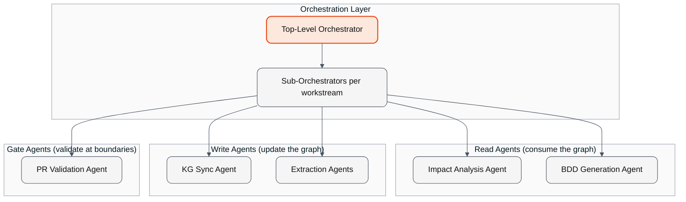
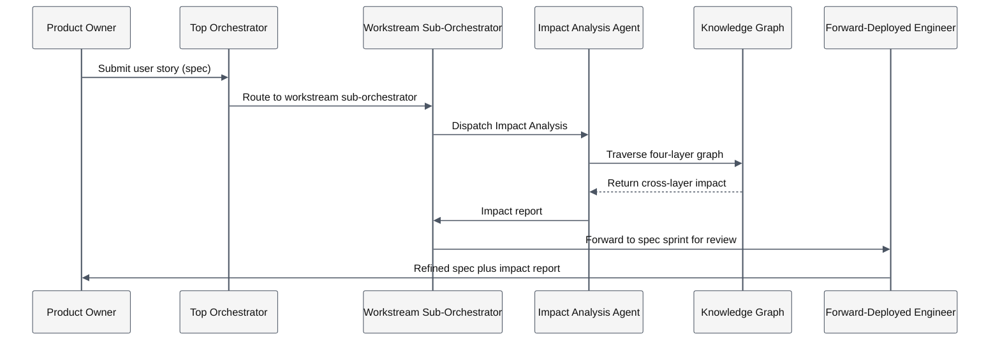
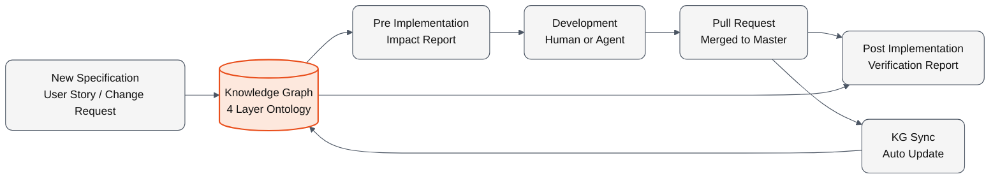

This section walks the fleet of agents that operate on the four-layer graph: how they orchestrate, what each one does, and how they earn the autonomy they exercise.

## Why the Agents Work

The agents in this section share four properties that make them reliable enough to put into production engineering workflows.

| Property | What it means |
|---|---|
| Constrained by the knowledge graph | The agent traverses the graph rather than guessing. It cannot generate code that violates an architectural boundary the graph defines. |
| Cognitive shortcut for context assembly | The work a senior developer does manually (assembling cross-layer context into a prompt) is now done by the agent against the graph. The output is the impact report as a markdown adjunct to the spec. |
| Variance bounded to implementation detail | Two runs of the same agent against the same spec produce different code in the small details. The structural elements (which service, which components, which tables) are constrained explicitly by the impact report. The remaining variance is acceptable. |
| Named human owner | Every agent has a named owner. The owner reviews outputs and approves writes to systems of record. No agent writes directly to a governed ontology node without human approval. |

## The Aspirational Endpoint

We want to stop writing code entirely and write only agents. The team operates the agent fleet, the agents operate on the knowledge graph, and the implementation step becomes the agent's job rather than the engineer's. We are not there yet everywhere. We are implementing it on selected workstreams where the team has the bandwidth to redesign the operating model alongside.

At that operating mode (Zone 4 in [Zones of AI-Assisted SDLC](zones-of-ai-assisted-sdlc/_index.md#zone-4-se-at-scale)), the Engineering Team's role evolves. They continue to steward the Code Ontology, and they also become the custodians of the agent fleet itself: overseeing the agents from Impact Analysis through PR Validation, approving Promotion Agreements that move agents to higher autonomy levels, and reviewing the audit trail. The bottom custodial layer in the Zone 4 diagram is this evolved role.

The methodology is rolled out faster than the operating model. The operating model is what unlocks the aspirational endpoint. [The Team](process/team.md) covers that side.

> **How Accion Labs operationalizes the agent fleet**
>
> The [Breeze.AI platform](practitioner/breeze-ai.md) implements the agent fleet described in this section. Each agent in production has a named human owner from Accion Labs's engagement team.

## Agent Fleet Topology

The agent fleet is the runtime layer that turns the knowledge graph into a working system. A small number of specialized agents, each with a defined responsibility and a named human owner, orchestrated through a two-level pattern. The fleet is small by design. Six to eight agents cover the operating model. Adding more agents adds operational surface area without adding leverage. We resist agent proliferation.

### The Fleet at a Glance



| Agent class | Purpose | Reads from | Writes to |
|---|---|---|---|
| Impact Analysis Agent | Pre and post implementation analysis of changes | Spec, ticket system, knowledge graph | Markdown impact report (adjunct to the spec) |
| PR Validation Agent | Gate every merge against all four ontologies | Knowledge graph, PR diff | Merge gate (pass or fail) |
| BDD Generation Agent | Generate test scenarios from the Functional Ontology | Functional Ontology | Test suite files |
| KG Sync Agent | Update the graph on every merge | Merged code, design files, spec changes | Knowledge graph nodes and edges |
| Extraction Agents | Initial brownfield extraction of each ontology layer | Existing code, design files, runtime behavior | Knowledge graph (one agent per ontology layer) |
| Cross-Product Impact Extension | Cross-product impact analysis when changes span products | Multiple product graphs | Markdown impact report |
| Portfolio Rationalization Agent | Quarterly cross-product duplication and dead-capability detection | All product graphs | Rationalization findings backlog |

### Two-Level Orchestration

A top-level orchestrator runs per engagement. It coordinates across products and workstreams, decides which sub-orchestrator handles a given request, and holds the policies that govern cross-product agent coordination.

Sub-orchestrators run per workstream. They coordinate the agents within a workstream, dispatch read, write, and gate agents in the right sequence for the request, and hold the workstream-specific configuration.

The pattern keeps coordination overhead manageable. Adding a new workstream means adding a sub-orchestrator, not modifying the top-level orchestrator. Cross-workstream coordination happens at the top level. Day-to-day agent calls happen within a single sub-orchestrator.

### Agent Ownership

The governing principle of the fleet: no agent writes directly to a governed ontology node without human approval, and every agent has a named human owner.

| Agent | Owner role |
|---|---|
| Impact Analysis Agent | Forward-Deployed Engineer for the workstream |
| PR Validation Agent | Tech Lead for the workstream |
| BDD Generation Agent | Tech Lead for the workstream |
| KG Sync Agent | Ontology Maintainer |
| Extraction Agents | Semantic Engineer during initial extraction; Ontology Maintainer thereafter |
| Cross-Product Impact Extension | Chief Architect |
| Portfolio Rationalization Agent | Chief Architect |

The owner reviews the agent's outputs, approves writes to systems of record, and arbitrates when the agent produces an output the team disagrees with. The owner is also the person who decides when to retrain the agent based on the agent-retrain trigger metrics. This is what keeps the knowledge graph an authoritative source of truth rather than a self-modifying artifact whose accuracy degrades silently over time.

### How a Request Flows Through the Fleet

A new user story arrives.



The same pattern applies to other requests. The orchestrator decides which agents to dispatch. The agents traverse the graph. The owners review and approve. The team consumes the output.

### What the Fleet Does Not Do

The fleet does not generate code without human-in-the-loop. The target state is "stop writing code, only write agents", but in the current state the implementation engineers still consume the impact-analyzed spec and produce code (with AI assistance, often Claude Code or Cursor). The fleet provides the structured context that makes that code reliable.

The fleet does not modify the knowledge graph based on the agent's own inference without human approval. The Extraction Agents propose graph updates; the Ontology Maintainer approves them. The KG Sync Agent updates the Code Ontology automatically from merged code, but structural changes to the ontology shape (adding a new entity type, changing a relationship type) require Chief Architect approval.

The fleet does not run unattended at autonomy levels beyond what the [Progressive Autonomy](#progressive-autonomy) discipline has authorized for a specific agent class. New agents start at the lowest autonomy level and earn higher autonomy levels through demonstrated evidence.

## The Impact Analysis Agent

The most demonstrable runtime use of the knowledge graph, and the easiest to show to a client in a single artifact.

### What It Does

A product manager writes a forty-line user story in an afternoon. Standard format: title, acceptance criteria, out-of-scope items, brief "why now". The story enters the Impact Analysis Agent. The agent traverses the four-layer knowledge graph for the application the change targets and produces a structured impact report.

Eight minutes later, the report identifies which functional outcomes change, which architectural entities are touched, which UI components need to be modified, which code modules and functions need to change, which database tables are affected, and which downstream services consume the change. The report includes a cross-layer traceability matrix linking each affected scenario through Functional → Design → Code → Architecture. It also includes single points of failure for the specific flow, a risk taxonomy with likelihood and consequence ratings, a QA test plan derived from the acceptance criteria, operational considerations, multi-service deploy coordination, and a suggested ticket-slicing plan.

A senior engineer with deep familiarity with the codebase would produce a comparable analysis in three to five working days, and would almost certainly miss several of the cross-cutting concerns. The agent produces the report in minutes.

### The Cognitive Shortcut Framing

The simplest way to think about the Impact Analysis Agent is as a cognitive shortcut. To get an AI coding agent like Claude Code or Cursor to produce reliable output on a complex codebase, a developer would otherwise have to assemble all the relevant cross-layer context into the prompt manually. The senior engineer who does this well is also the engineer who knows where to look in the codebase, who understands the architectural boundaries, who has seen prior changes go wrong in the same area, who knows which database tables matter, and who can hold all of this in working memory while writing the prompt.

This assembly work is a substantial fraction of why senior engineers are productive with AI tooling and less-tenured engineers are not. The Impact Analysis Agent does the context-assembly automatically by traversing the knowledge graph, and emits the impact report as a markdown adjunct to the specification. The senior engineer's mental shortcut becomes a systematic capability available to every engineer on the team.

### The Variance-Bounding Insight

AI code generation from the same specification produces nondeterministic output by default. Two runs of Claude Code against the same prompt produce different code. This nondeterminism is the most common CTO objection to AI-assisted development at enterprise scale. The objection is real.

The Impact Analysis Agent does not eliminate this nondeterminism. It bounds it.

With the impact analysis report attached to the prompt, the structural elements of the output (which service, which components, which tables) are constrained explicitly. The agent no longer needs to consult the codebase to figure out where to make changes. The report has already told it where. What remains variable is implementation-detail level (variable naming, the precise form of a function, the order of operations within a block) and that variance is acceptable.

The shift this produces in practice: code review focus moves from "did the agent get the right files?" to "is the implementation detail correct?" The first question consumed most of the senior engineer's review time. The second is the kind of judgment call review was supposed to be for in the first place.

### Pre-Implementation Mode

When a new specification arrives (a user story, a change request, a feature brief), the Impact Analysis Agent runs the spec against the knowledge graph and produces the report before any code is written. The team enters implementation with a full map of the blast radius across all four ontologies.

| Question | Pre-implementation impact report answers |
|---|---|
| Which other repositories will this touch? | Yes, with file paths and function names |
| Which other teams' contracts will this affect? | Yes, with the specific API contracts identified |
| Which UI components already exist that this should reuse? | Yes, with component IDs |
| Which database schema changes are required? | Yes, with column-level findings including "this column already exists with the comment 'supports this exact use case'" |
| Which integration points will this need to coordinate with? | Yes, with the specific integration paths and the coordinating teams |
| Which deploy ordering is required across repos? | Yes, with the specific deploy sequence and the rollback path per service |

The pre-implementation report is the input the spec sprint review uses to decide whether to ship the change as specified, modify the spec, or split the change into smaller pieces that can be shipped independently.

### Post-Implementation Mode

When the implementation is merged to the master branch, the same agent reruns the analysis on the actual code change and compares the post-implementation impact with the pre-implementation prediction. The comparison answers three questions automatically.

| Question | What it surfaces |
|---|---|
| Did the implementation cover everything the spec required? | Gaps where the code did not touch areas the spec said it should |
| Did the implementation touch areas the spec did not anticipate? | Scope creep, or undocumented effects of the change |
| Did the implementation diverge from what was specified? | Drift between intent and reality, caught before it becomes a production incident |

The knowledge graph is updated continuously as part of the merge process, so the next analysis runs against current reality.



### A Worked Example

A real user story run through the agent against a 1.6 million LOC Node.js, TypeScript, and React application.

**Input.** A forty-line markdown user story: "Let users choose how often they receive email alerts for each saved search: Daily, Weekly, or Off." Standard product brief format, with acceptance criteria, out-of-scope items, and a brief "why now".

**Output.** A structured fifteen-section impact analysis report.

| Report section | What it captured |
|---|---|
| Executive Summary | The headline insight that the database substrate was already half-built; the change was therefore application-layer, not schema-migration |
| Functional Layer | Nine functional nodes affected: two outcomes modified, two scenarios added, two existing scenarios touched, three actions modified, with their unique ontology IDs |
| Design Layer | Seven design components and user journeys affected: three components, three user journeys, one new email template |
| Code Layer | Fifteen specific code-level changes: file paths, endpoints, current behavior, required additions, across five distinct repositories |
| Architecture Layer | Fourteen architecture nodes touched: services, data stores, queues, infrastructure |
| Data Layer | Full schema-side verdict per database instance, with column-level findings showing the alert-type column already existed with the comment "0: daily, 1: week, 2: monthly" |
| Cross-Layer Traceability Matrix | One row per affected scenario, linking Functional → Design → Code → Architecture |
| Single Points of Failure | Four SPOFs identified for this specific flow |
| Risk Taxonomy | Six risks with likelihood and consequence ratings and specific mitigations |
| QA Test Plan | Twelve specific test cases derived from the acceptance criteria |
| Multi-Service Deploy Coordination | Explicit deploy order across three repos plus out-of-band steps |
| Suggested Ticket Slicing | Nine specific tickets with explicit dependency ordering |

### The Three Findings That Would Have Cost the Most to Discover Manually

Three categories of finding in this report are extremely hard for a human reviewer to produce in any reasonable time.

The substrate insight. The report identified that the alert-type column already existed in both regional databases with the comment "0: daily, 1: week, 2: monthly" already in place, and that the filter function was already present in the notification-feed DSL. This single finding reclassified the change from "schema migration plus application change" to "application change only" with no DDL required. A human reviewer would need to grep across 1.6 million LOC and read multiple migration files to discover this. The agent surfaced it from the graph in seconds.

The cross-cadence pollution risk. The report identified that the existing populate-daily worker iterates "saved searches with alerts on". Once a "Weekly" flag is introduced, the daily worker has to add an explicit "alertType = Daily" filter, otherwise weekly subscribers receive both a daily email and a weekly digest. This is the kind of risk that ships to production and surfaces as a customer-reported incident. The agent flagged it as HIGH likelihood and HIGH consequence with a specific mitigation, including the file and function to modify.

The deploy choreography. The report identified that three repos have to deploy together (or in a specific order), plus an out-of-band template upload that has no Terraform owner, plus a scheduler entry that lives outside the V2 codebase. Discovering this manually requires institutional knowledge held by long-tenure engineers or a multi-day archaeology exercise. The agent produced it from the architecture graph.

### What This Changes for the Team

Three operational shifts follow from putting the Impact Analysis Agent into the team's normal workflow.

Code review focus moves upstream. Reviewers stop asking "did the agent touch the right files" and start asking "is the implementation detail correct". The first question is now answered by the impact report. The second is the judgment call review was always supposed to be for.

The spec sprint becomes the primary risk-management surface. Since pre-implementation impact analysis surfaces blast radius before code is written, the spec sprint is where risk is identified and mitigated. The implementation sprint becomes the lower-risk activity: a known plan being executed.

Senior engineers spend their time on judgment, not context assembly. The senior engineer's most valuable contribution is the judgment they bring to ambiguous decisions. The methodology takes the context-assembly work off their plate and lets them spend their time where it counts.

> **How Accion Labs operationalizes the Impact Analysis Agent**
>
> The [Breeze.AI platform](practitioner/breeze-ai.md) runs the Impact Analysis Agent in both pre and post implementation modes against the four-layer knowledge graph. For cross-product changes, the Cross-Product Impact Extension consults multiple product graphs in sequence. See [Partition by Product](semantic-knowledge-graphs/four-layer-ontology.md#partition-by-product).

## The PR Validation Agent

The merge-time gate. Every PR runs through this agent before it can merge to master. The agent validates the change against all four ontologies and refuses merges that violate the structure the methodology depends on.

The Impact Analysis Agent is the pre-implementation context provider. The PR Validation Agent is the post-implementation enforcement layer. Together they bracket the development cycle.

### What the Gate Checks

The PR Validation Agent runs four classes of check on every PR.

| Check class | What it validates |
|---|---|
| Functional consistency | Does the change touch outcomes the spec said it would touch? Does it touch outcomes the spec did not anticipate? |
| Design consistency | Does the change reuse existing components where existing components fit? Does it create duplicates of components already in the design system? |
| Architecture consistency | Does the change respect service boundaries? Does it introduce cross-boundary dependencies the architecture ontology does not allow? |
| Code consistency | Does the change break downstream consumers? Does it modify code owned by another team without their approval? |

A check failure produces a structured error message identifying the specific violation, the ontology node involved, and the path to remediation. The PR cannot merge until the violation is addressed.

### What the Gate Does Not Do

The PR Validation Agent does not enforce stylistic preferences. It does not run the linter. It does not check unit test coverage. Those checks belong in the conventional CI pipeline and run separately.

The gate does not block PRs for cosmetic reasons. It blocks PRs for structural reasons. The distinction matters: the cost of a false-positive structural block is high (engineers stop trusting the gate), so the gate is calibrated to fail only when the structural violation is unambiguous.

The gate does not arbitrate intent. If a structural violation reflects a deliberate architectural decision, the engineer can request an override from the Chief Architect. The override is logged in the audit trail. Frequent overrides are a signal that the ontology needs to be updated, not that the gate is wrong.

### How the Gate Catches Cross-Team Contract Violations

The most operationally important capability: catching cross-team contract violations before integration.

A change in Repo A modifies an API endpoint. The Architecture Ontology shows that Repo B consumes that endpoint. The Code Ontology shows that the consumer in Repo B expects a specific field. The change in Repo A removes the field. Under SDD alone, this would surface during integration, after both PRs had merged independently. Under the PR Validation Agent, the Repo A PR is blocked because the Architecture Ontology flags the breaking change in the downstream consumer.

The engineer has three options at that point.

1. Update both repos in a coordinated change. The PR includes the consumer update and both pieces merge together.
2. Add a backward-compatible variant. The endpoint supports both the old and new field shape and the consumer migrates on its own cadence.
3. Coordinate with the consuming team. The change is deferred until the consumer team approves the breaking change and updates accordingly.

All three are normal engineering responses. The methodology surfaces the choice at the right time, when it is cheap to address.

### How the Gate Catches Design System Duplication

The second most valuable capability: catching design system duplication before it ships.

A developer is implementing a new modal dialog. The Design Ontology has a `<ConfirmModal>` component that exists for this exact use case. The developer, working from the spec, does not know the component exists and creates a new `<DeleteConfirmation>` component that is structurally identical.

The PR Validation Agent flags the duplication. The PR cannot merge until the developer either reuses the existing component or, if there is a legitimate reason to create a new one, justifies the new component to the Design System Owner. The Design System Owner approves the new component (and adds it to the design system) or asks the developer to use the existing one.

This is what prevents the design system erosion that defeats most SDD-disciplined teams. The enforcement happens at the PR gate, not in retrospective design reviews three quarters later when the design system has fragmented.

### The Override Audit Trail

When the gate is overridden, the override is logged with the PR that was overridden, the check class that failed, the specific ontology node involved, the person who approved the override, and the justification provided.

The audit trail is reviewed by the Chief Architect on a quarterly cadence. Override patterns are signals. Frequent overrides for the same kind of violation suggest the ontology needs to be updated to reflect a new pattern the team has adopted. Single overrides are normal. Patterns of overrides are diagnostic.

### Why the Gate Is Worth the Friction

A team adopting the PR Validation Agent will experience friction in the first few sprints. PRs that would have merged before now require additional coordination. The friction is the point. We are choosing to surface coordination work at the moment it is cheapest to address (PR gate) rather than at the moment it is most expensive to address (production incident).

The cost of a single production incident traceable to a structural violation typically exceeds the cumulative friction of all the PR gate blocks for the same class of violation over a year. The gate is paying for itself with the first incident it prevents.

> **How Accion Labs operationalizes the PR Validation Agent**
>
> The [Breeze.AI platform](practitioner/breeze-ai.md) runs the PR Validation Agent in the client's CI/CD pipeline. The agent's configuration is owned by the workstream's Tech Lead. The override audit trail is reviewed by the engagement's Chief Architect on a quarterly cadence.

## The BDD Generation Agent

Behavior-Driven Development scenarios are the discipline nobody quite manages to maintain. Specifications get written, BDD scenarios get derived in the first sprint of a feature, and then deadline pressure wins. By the third sprint the scenarios are stale. By the sixth they are abandoned. The test suite continues to run but no longer reflects the system's actual behavior.

The BDD Generation Agent removes this failure mode by producing the scenarios automatically from the Functional Ontology. The scenarios are derived from the same structure the rest of the methodology consumes. The maintenance problem disappears because there is nothing to maintain by hand.

### What the Agent Produces

For each user story or change request processed through the methodology, the agent generates BDD scenarios in standard Gherkin format. Each scenario maps to a node in the Functional Ontology.

Given a Functional Ontology with the structure:

- Persona: Saved Search Owner
- Outcome: Receive a weekly digest of new matches
- Scenario: First-time configuration of weekly alerts
- Step: Open saved search → Configure alert frequency → Save

The agent generates:

```gherkin
Feature: Configure email alert frequency
  As a Saved Search Owner
  I want to choose how often I receive email alerts
  So that I can match the alert cadence to my workflow

  Scenario: First-time configuration of weekly alerts
    Given I have a saved search with alerts off
    When I open the saved search
    And I configure the alert frequency to "Weekly"
    And I save the configuration
    Then weekly alerts are enabled for this saved search
    And the next email will arrive on the configured weekly schedule
```

The scenarios are generated per persona, per outcome, per scenario node. A user story affecting two outcomes for two personas produces four families of scenarios automatically.

### What Auto-Generation Replaces

Manual BDD authoring has three failure modes the agent eliminates.

| Failure mode | What it looks like | How the agent eliminates it |
|---|---|---|
| Authoring slips under deadline pressure | First sprint of the feature produces scenarios. Second sprint produces fewer. By the sixth sprint, none. | The agent generates scenarios as a byproduct of the ontology update. No human authoring required. |
| Scenarios go stale | The application evolves. The scenarios do not. The test suite still passes against the wrong behavior. | The agent regenerates scenarios on every Functional Ontology update. Stale scenarios cannot accumulate. |
| Coverage gaps go undetected | The team thinks coverage is high. The reality is that coverage is high on the easy paths and missing on the edge cases. | The agent generates scenarios for every Persona, Outcome, Scenario combination the ontology contains. Coverage tracks the ontology structure directly. |

The result is that BDD becomes the default discipline rather than the aspirational one. Coverage in the 90%+ range is achievable without the team carrying the authoring burden.

### Coverage as a Byproduct of the Ontology

Test coverage stops being a thing the team has to budget for. It is what the Functional Ontology produces.

| Coverage metric | How it tracks |
|---|---|
| Personas covered | All personas in the Functional Ontology have generated scenarios |
| Outcomes covered | All outcomes per persona have generated scenarios |
| Scenarios covered | All scenarios per outcome have generated step-level coverage |
| Steps covered | All steps per scenario have generated action-level test cases |

A team operating under the methodology typically reaches 93.4% test coverage with zero manual BDD overhead. The remaining 6.6% is what the team chooses not to cover, such as deliberately deferred edge cases or scenarios marked out-of-scope. The coverage gap is intentional, not accidental.

### How the Agent Handles Changes

When a user story modifies the Functional Ontology (adds a new outcome, modifies an existing scenario, removes a deprecated action), the agent identifies the affected ontology nodes, generates new scenarios for added nodes, updates scenarios for modified nodes, removes scenarios for deleted nodes, and surfaces the diff for human review.

The human review step matters. The agent does not blindly delete scenarios just because the ontology changed. A removed scenario might reflect a deprecation that was intentional or an extraction error. The Tech Lead reviews the diff and approves the change. The approval is logged in the audit trail.

### Where the Test Cases Actually Run

The agent generates the test scenarios. It does not own the test execution. Test execution happens in the conventional CI pipeline, against the same test runners the team is already using. The agent is opinion-free about which test runner the team uses; it emits standard Gherkin that any BDD framework can consume.

This separation is deliberate. The agent's value is in generating consistent, complete scenarios. Test execution is a solved problem the team's existing toolchain handles. We do not try to displace working infrastructure.

### When the Agent Does Not Help

The BDD Generation Agent is most valuable for functional behavior. It is less valuable for non-functional concerns (performance, security, reliability) that do not map cleanly to the Persona, Outcome, Scenario structure of the Functional Ontology.

For non-functional testing, the team continues to use the same patterns they use today: load testing tools for performance, security scanning tools for security, chaos engineering for reliability. The BDD Generation Agent handles the functional coverage. The team handles the non-functional coverage. The combination produces a fuller test posture than either alone.

> **How Accion Labs operationalizes the BDD Generation Agent**
>
> The [Breeze.AI platform](practitioner/breeze-ai.md) runs the BDD Generation Agent against the client's Functional Ontology. Generated scenarios are committed to the test suite repository with the Tech Lead as the named approver for diffs.

## The KG Sync Agent

The agent that prevents the methodology from degrading into a stale documentation artifact. On every PR merge, the KG Sync Agent updates the knowledge graph to reflect the new code, the new design references, and the new architectural relationships the change has introduced.

Drift is what kills knowledge artifacts. Text documentation drifts because humans do not update it under deadline pressure. The Functional, Design, and Architecture ontologies would drift the same way if humans had to maintain them by hand. The KG Sync Agent removes the human-maintenance dependency. The graph stays current because the agent keeps it current automatically, every commit.

### What the Sync Touches

The agent updates each of the four ontology layers based on what the merge introduced.

| Ontology | What sync updates |
|---|---|
| Code | Function additions, removals, signature changes; class hierarchy changes; new modules; endpoint changes; database schema migrations |
| Architecture | Service additions; new integration points; modified bounded-context boundaries (with custodianship approval); infrastructure topology changes |
| Design | Component additions and removals; design system primitive updates; Figma reference updates |
| Functional | New scenarios introduced when the merge implements a new user story; action signature changes |

The Code Ontology is the highest-frequency update. Every merge changes code. The other three layers update less frequently, only when the merge introduces structural changes at those layers.

### The Update Flow

```mermaid
%%{init: {"theme":"base","themeVariables":{"primaryColor":"#f5f5f5","primaryTextColor":"#111111","primaryBorderColor":"#4b5563","lineColor":"#4b5563","secondaryColor":"#ffffff","tertiaryColor":"#FDE8DD","clusterBkg":"#fafafa","clusterBorder":"#9ca3af","edgeLabelBackground":"#ffffff","actorBkg":"#f5f5f5","actorBorder":"#4b5563","actorTextColor":"#111111","noteBkgColor":"#FDE8DD","noteBorderColor":"#E94E1B","signalColor":"#4b5563","signalTextColor":"#111111","sectionBkgColor":"#f5f5f5","altSectionBkgColor":"#ffffff","taskBkgColor":"#9ca3af","taskBorderColor":"#4b5563","taskTextColor":"#111111","gridColor":"#d1d5db","activeTaskBkgColor":"#FDE8DD","activeTaskBorderColor":"#E94E1B"}}}%%
flowchart LR
    PR[PR Merged to Master]
    PARSE[Parse changed files]
    UPDATE[Update Code Ontology]
    CASCADE[Cascade to other layers if structural]
    VALIDATE[Run P0 verification suite]
    COMMIT[Commit graph update]
    NOTIFY[Notify ontology owners of structural changes]

    PR --> PARSE
    PARSE --> UPDATE
    UPDATE --> CASCADE
    CASCADE --> VALIDATE
    VALIDATE --> COMMIT
    COMMIT --> NOTIFY
    classDef default rx:10,ry:10;
```



The flow is automatic for non-structural changes (a new function in an existing module, a bug fix that does not change interfaces). Structural changes (a new service, a new bounded context, a new design system primitive) trigger a notification to the relevant ontology owner for review before the graph update commits.

### What Triggers Human Review

The KG Sync Agent runs automatically for routine updates. Three categories of change require human review before the sync commits.

| Trigger | Reviewer | Why review |
|---|---|---|
| New entity type in any ontology | Chief Architect | Adding entity types changes the ontology shape; needs deliberate decision |
| Modified relationship type between ontologies | Chief Architect | Cross-layer relationships are structurally consequential |
| Cross-product integration point added or removed | Ontology Maintainer plus Chief Architect | Cross-product changes affect the Cross-Product Impact Extension's reasoning |

Routine updates (functions, methods, components within an existing structure) sync automatically and become part of the graph within seconds of the merge.

### Why Sync Must Be Continuous

A team that runs sync on a quarterly cadence rather than on every merge has lost the benefit of the methodology. Within one quarter, the graph drifts far enough that the Impact Analysis Agent's outputs become unreliable. The team starts working around the impact analysis. The custodianship discipline erodes. Within two quarters, the team is operating at Zone 2 again, with a stale graph as an additional maintenance burden rather than an asset.

Our commitment to per-merge sync is what distinguishes Semantic Engineering from the earlier knowledge graph initiatives that failed because the maintenance cost outpaced the value.

### Failure Modes

Two failure modes we handle explicitly.

| Failure mode | What it looks like | Response |
|---|---|---|
| Sync produces an invalid graph state | A P0 verification check fails on the post-merge graph | The merge is reverted; the team investigates the structural issue before re-attempting |
| Sync falls behind | The sync queue grows because merges are happening faster than the agent can process | The Ontology Maintainer is paged; the agent's processing capacity is reviewed and increased |

Sync falling behind is rare in practice. Per-merge sync on a 1.6M LOC application typically completes in seconds. The capacity ceiling has not been hit in production engagements.

> **How Accion Labs operationalizes the KG Sync Agent**
>
> The [Breeze.AI platform](practitioner/breeze-ai.md) runs the KG Sync Agent as part of the client's CI/CD pipeline. Sync is triggered automatically on every merge to master. The Ontology Maintainer from the Accion Labs engagement team owns the agent's operational health.

## Progressive Autonomy

The discipline that controls what each agent in the fleet is authorized to do. Agents do not start out trusted. They earn trust through demonstrated evidence over time. The level of autonomy an agent exercises is calibrated to the evidence it has accumulated for the specific task class it operates on.

The most common failure mode in enterprise AI adoption is the leap of faith. A team gives an agent broad authority based on demo performance and discovers in production that the agent's failure modes were not visible in the demo. Progressive autonomy is the structural response. Authority is granted incrementally, against evidence, with a clear path forward and a clear path back.

### The Five Levels

| Level | Name | What the agent does | Who is in the loop |
|---|---|---|---|
| 1 | Suggest | The agent produces a recommendation; a human evaluates and may or may not act on it | Human is the executor |
| 2 | Assist | The agent produces output; a human reviews each output before it is acted on | Human is the reviewer |
| 3 | Execute under approval | The agent acts, but each action requires explicit human approval before commit | Human approves per action |
| 4 | Execute with audit | The agent acts autonomously; humans review outcomes on a defined cadence | Human audits, does not gate |
| 5 | Execute autonomously | The agent acts without human review in the routine case; humans intervene only on exceptions | Human handles exceptions only |

A new agent class always starts at Level 1. Promotion to a higher level requires the agent to demonstrate that the failure rate at the current level is below the threshold we define for that task class.

### The Promotion Agreement

Moving an agent from one level to the next is a deliberate act. The Promotion Agreement is the artifact that captures the decision.

| Promotion Agreement element | Content |
|---|---|
| Agent class | Which agent is being promoted (Impact Analysis, PR Validation, etc.) |
| Task class | Which specific task class within the agent (some agents handle multiple task classes that can be promoted independently) |
| Current level | The level the agent operated at before the promotion |
| Target level | The level the agent is being promoted to |
| Evidence | The metrics that justify the promotion (failure rate, false-positive rate, business outcomes) |
| Threshold | The threshold metric that triggered the promotion |
| Approver | The named human who authorized the promotion (typically the Chief Architect for cross-cutting agents, the Tech Lead for workstream-specific agents) |
| Rollback criteria | The metric values that would trigger automatic demotion |
| Audit cadence | How frequently the agent's outcomes are reviewed at the new level |

The Promotion Agreement is logged in the audit trail and is reviewable by anyone with custodianship-level access. Promotions are not silent.

### How Evidence Is Built

An agent at Level 1 produces recommendations. Humans evaluate the recommendations. Some recommendations are correct (the human acts on them). Some are incorrect (the human rejects them or modifies them before acting). The disposition of each recommendation is logged.

After a sufficient sample size, the agent's accuracy rate at Level 1 can be calculated. If the accuracy rate exceeds the threshold for Level 2 (typically 95% for routine task classes, higher for safety-critical ones), the agent can be promoted to Level 2.

At Level 2, the agent produces output that humans review. The review disposition is logged. After a sufficient sample size at Level 2, the agent's quality at Level 2 can be assessed. And so on through the levels.

The progression is not automatic. Each promotion requires a deliberate decision and a Promotion Agreement. We resist the drift toward higher autonomy without the supporting evidence.

### The Audit Trail

Every agent action at every level is logged. The audit trail captures the agent that acted, the task class, the input the agent received, the output the agent produced, the level of autonomy the action was authorized at, the human who reviewed or approved (if applicable), and the outcome (was the action successful, did it require correction, and so on).

The audit trail is reviewable by the Engagement Council (see [The Enablement Partnership](process/enablement-partnership.md)) and is the basis for the agent's evidence accumulation.

### Why the Discipline Is Worth the Overhead

The Promotion Agreement and the audit trail add operational overhead. The overhead is the point. We are choosing to be slow in promoting agents in order to be confident in the promotions.

The alternative (rapid promotion based on demo performance) produces the leap-of-faith failure mode. An agent that performs well on the easy cases gets promoted, then fails catastrophically on a hard case in production. The cost of the catastrophic failure (production incident, audit finding, regulatory exposure, client relationship damage) exceeds the cumulative cost of the slow promotion discipline by orders of magnitude.

### Rollback and Demotion

Promotion is not one-directional. An agent that has been promoted to Level 3 but starts failing at the threshold rate gets demoted back to Level 2. The rollback criteria are part of the Promotion Agreement, so the demotion is automatic when the criteria are met.

| Demotion trigger | What happens |
|---|---|
| Failure rate exceeds the rollback threshold | The agent automatically reverts to the previous level; the Engagement Council is notified |
| The agent retrain trigger fires | The agent is paused at all levels; retraining is scheduled before any actions resume |
| A Sev-1 incident is traced to the agent's output | The agent reverts to Level 1; root-cause analysis is required before any re-promotion |

Demotion is not a failure of the methodology. It is the methodology working as designed. Agents that no longer meet the threshold for their current level should not operate at that level. The cycle of promotion, evidence accumulation, and (when warranted) demotion is what keeps the agent fleet trustworthy over time.

### The Five Levels Mapped to Agent Classes

In practice, different agents in the fleet operate at different levels.

| Agent | Typical autonomy level in steady-state operation |
|---|---|
| Impact Analysis Agent | Level 4 (executes autonomously, humans audit outcomes); Level 5 is achievable for stable task classes |
| PR Validation Agent | Level 4 (executes the gate autonomously; humans handle overrides) |
| BDD Generation Agent | Level 3 (executes under approval; the Tech Lead approves the scenario diff for each user story) |
| KG Sync Agent | Level 4 for routine sync; Level 2 for structural changes which require human review |
| Extraction Agents | Level 2 during initial extraction (heavy human review); Level 4 for refresh sprints (audit only) |
| Cross-Product Impact Extension | Level 3 (executes under approval; the Chief Architect approves the analysis for each cross-product change) |
| Portfolio Rationalization Agent | Level 4 (runs autonomously on the quarterly cadence; outputs feed the rationalization backlog) |

The levels shift over time as evidence accumulates. The promotion path for each agent class is owned by the Chief Architect.

> **How Accion Labs operationalizes progressive autonomy**
>
> The [Breeze.AI platform](practitioner/breeze-ai.md) implements the five autonomy levels and the Promotion Agreement workflow. The Engagement Council reviews promotion decisions on a quarterly cadence as part of the [enablement engagement](process/enablement-partnership.md).

---

[The Team](process/team.md) covers the operating model that makes the agent fleet sustainable at enterprise scale.
