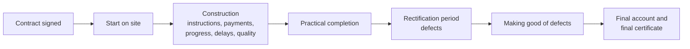

# Contract administration: the user's work, and how NBS Contract Administrator supports it

Status: working draft, October 2026. To be checked with practising contract administrators.

## 1. Purpose and sources

This document describes the work of a contract administrator on a UK building project, separately from any software. It then compares that work with what NBS Contract Administrator (NBS CA) does.

Sources:

- The NBS CA help pages and developer notes at nbsca-support.lovable.app, which describe what the software does.
- General knowledge of how JCT contracts are administered. Time limits and procedures are given for the JCT Standard Building Contract (SBC) 2016 unless stated otherwise. Other contracts and editions differ: Minor Works is simpler, and Design and Build replaces the architect with an Employer's Agent. Each time limit should be checked against the edition in question before it is relied on.

What is not known: how users actually spend their time, and what they complain about. NBS's support records, and conversations with users, are needed for that (section 11).

## 2. What contract administration is

A building contract is signed between the **employer** (the client paying for the building) and the **contractor** (who builds it). The contract names a third person, the **contract administrator** (CA), who runs the contract while the building is built. On JCT contracts this is usually the project architect, so the contract and the forms say "Architect/Contract Administrator". On Design and Build contracts, the **Employer's Agent** does a similar job.

The CA works in two capacities:

1. **As the employer's agent.** The CA issues instructions that change or clarify the work, and reports to the employer on cost and progress.
2. **As an independent certifier.** When the CA certifies payments, completion, delays and defects, the CA must act fairly between the employer and the contractor, even though the employer pays the CA's fees. Certificates have contractual and legal effect. The final certificate in particular is conclusive evidence on several matters, which limits later disputes.

The CA does not build anything or pay anyone. The CA's output is **decisions, recorded in formal documents, issued on time, to the right people**. Most of the risk in the role comes from three failures: a wrong decision, a correct decision recorded wrongly, and a decision made too late, after a contractual time limit has passed.

## 3. The people involved

| Party | Role in contract administration |
|---|---|
| Employer | The client. Pays the contractor; may deduct liquidated damages; may give pay less notices; approves budget changes. |
| Contractor | Builds the work. Applies for payment, gives notices of delay, submits claims and the final account information. |
| Contract administrator (architect) | Issues instructions and certificates; decides extensions of time; inspects. |
| Employer's Agent | Does a similar job on Design and Build contracts. |
| Quantity surveyor (QS) | Values the work for interim payments, values variations, prepares the final account, reports cost. Usually appointed by the employer. |
| Clerk of works | Inspects work on site for the employer and issues directions, which only have effect once the CA confirms them by instruction. |
| Consultants (structural, services engineers) | Supply design information that often becomes the content of instructions. |
| Sub-contractors and named specialists | Employed by the contractor. Some contracts give the CA a say in their selection. |

## 4. The life of a contract

| Stage | Main CA work | Main documents |
|---|---|---|
| Contract signed | Record the contract particulars; set up the team and distribution | Contract, contract particulars |
| Start on site | Confirm possession; pre-start meeting; check insurances and bonds | Minutes, notices |
| Construction (most of the job, months to years) | Instructions, monthly interim payments, progress monitoring, delay decisions, inspections | Instructions, interim certificates, extension of time decisions, clerk of works directions |
| Practical completion | Inspect; decide whether the works are complete; certify | Practical completion certificate (or non-completion certificate if late) |
| Rectification period (typically 6 to 12 months) | Collect defects; issue schedule of defects; check they are put right | Schedule of defects, instructions, certificate of making good |
| Final account | Agree the adjusted contract sum; issue final certificate | Final adjustment statement (QS), final certificate |

## 5. Activities in detail

For each activity: what starts it, what the CA has to decide, what the CA then does, where the information comes from, the time limits, and what could be automated.

### 5.1 Setting up the contract

- **Trigger:** the contract is signed.
- **Decisions:** none of substance. The terms are already fixed by the contract.
- **Actions:** record the contract sum, base date, date of possession, completion date, sections, retention percentage, rate of liquidated damages, rectification period, payment periods, and the parties and consultants. Set up who receives which documents.
- **Information comes from:** the signed contract (contract particulars), the practice's contacts.
- **Automation:** high. The contract particulars follow a standard layout, so they can be read from the signed contract document and confirmed by the CA rather than typed.

### 5.2 Instructions and variations

This is the most frequent activity on most jobs.

- **Trigger:** a design change, a client request, a question from the contractor (an RFI, request for information), a discrepancy between documents, a provisional sum to be spent, defective work, or a clerk of works direction to confirm.
- **Decisions (CA judgement):**
  - Is an instruction needed, and is the CA empowered to give it under the contract?
  - Is it a variation (a change that alters the contract sum), or does it only clarify what the contract already requires?
  - Does the employer need to approve the cost first? Usually required by the CA's appointment, not by the building contract.
  - Is the instruction worded precisely enough to avoid a later dispute?
- **Actions:** draft the instruction with its items; get a cost estimate from the QS; issue to the contractor and copy to the team; record it.
- **Information comes from:** drawings and specifications from the design team, meeting minutes, RFIs, the QS.
- **Time limits:** the contractor must comply within the contract's period. Oral instructions must be confirmed in writing, and the contract sets the periods for doing so.
- **Automation:** medium.
  - Automatable: numbering, addressing, distribution, links to the drawings.
  - Assistable: drafting instruction items from minutes or RFIs for the CA to review; flagging items that look like variations; checking that every confirmed clerk of works direction has an instruction.
  - Human only: whether to instruct, and the final wording.

### 5.3 Valuing changes and reporting cost

- **Trigger:** each instruction that changes the work; the client's regular cost reports.
- **Decisions:** the QS values variations under the contract's valuation rules, and the CA accepts or questions the valuation. The client decides how to deal with budget overruns.
- **Actions:** record each instruction item's cost as it moves through three stages: estimated (QS, at issue), claimed (contractor), agreed (after negotiation). Report the projected final cost to the client.
- **Information comes from:** the QS's estimates and cost reports (often spreadsheets), the contractor's quotations and claims.
- **Automation:** high for collecting and reporting. If the QS and contractor enter their figures directly, nobody retypes them. Forecasting the final cost from estimates, claims and agreed figures is a calculation.

### 5.4 Interim payments

This is repeated monthly up to practical completion, and at longer intervals after it.

- **Trigger:** the payment due date for each period, fixed by the contract.
- **Decisions (CA judgement):** the gross value of work properly executed and materials on site. In practice this is based on the QS valuation, which is often based on the contractor's payment application. The CA is responsible for the certificate and must certify independently.
- **Actions:** take the gross valuation; apply retention (full rate before practical completion, half after); deduct amounts previously certified; work out the amount due and VAT; issue the interim certificate (the payment notice) within the time limit.
- **Information comes from:** the contractor's application, the QS valuation, the job's previous certificates.
- **Time limits (SBC 2016):**
  - The contractor may apply before the due date.
  - The CA issues the interim certificate no later than 5 days after the due date.
  - The final date for payment is 14 days after the due date.
  - If the employer intends to pay less, the employer must give a pay less notice no later than 5 days before the final date for payment.
  - If no certificate is issued in time, the contractor's application can become the sum due. This makes a missed deadline costly for the employer.
- **Automation:** high. Everything after the gross valuation is calculation, and the dates can be calculated from the due date. Reminders before each due date and checks of the QS valuation against the application can also be automated. The valuation itself stays a professional judgement.

### 5.5 Progress, delay and extensions of time

- **Trigger:** the contractor's notice that progress is or will be delayed.
- **Decisions (CA judgement):** this is among the hardest and most disputed.
  - Is the cause a "relevant event" under the contract, for which the contractor is entitled to more time?
  - Will it delay completion, and by how much?
  - What is the new completion date? After practical completion the CA reviews the completion date again.
- **Actions:** request any missing particulars; assess the delay against the programme; fix a new completion date (or decide not to) and notify it; keep the completion date and the status of each section up to date.
- **Information comes from:** the contractor's notice and supporting particulars, the programme, progress records, site minutes, the CA's own records of instructions issued (since late instructions are themselves a relevant event).
- **Time limits (SBC 2016):** the CA must decide within 12 weeks of receiving the required particulars, or before the completion date if that is sooner. The review after practical completion has its own time limit.
- **Automation:** low for the decision, high for support. Automatable: logging notices received, starting the 12-week clock, assembling the related instructions and minutes, updating the completion date once decided. The assessment of cause and effect stays with the CA, and often with a planning specialist.

### 5.6 Quality, inspections and defective work

- **Trigger:** site visits, clerk of works reports, tests.
- **Decisions:** is the work in accordance with the contract? Should work be opened up for inspection, removed, or accepted with an adjustment?
- **Actions:** inspect and record findings; issue instructions about defective work; confirm or reject clerk of works directions.
- **Information comes from:** the CA's site visits, the clerk of works, test results, photographs.
- **Automation:** medium. Site reports with photographs, a defects log, and tracking items until they are closed are all record-keeping. Whether work is acceptable is a human judgement.

### 5.7 Completion: practical completion, partial possession, non-completion

- **Trigger:** the contractor says the works (or a section) are complete; the completion date passes without completion; the employer wants to occupy part of the building early.
- **Decisions (CA judgement):**
  - In the CA's opinion, is practical completion achieved? Have the conditions the contract attaches to it been met, such as handing over health and safety and as-built information?
  - If the completion date has passed, issue a non-completion certificate.
- **Actions:** carry out the completion inspection and agree the snagging list; issue the practical completion certificate, the non-completion certificate, or the partial possession statement.
- **Effects of practical completion:**
  - half of the retention is released;
  - the rectification period starts;
  - the contractor stops being liable for liquidated damages;
  - responsibility for insurance moves to the employer.

  A non-completion certificate allows the employer to deduct liquidated damages, subject to the employer giving the notices the contract requires.
- **Automation:** low for the decision, high for what follows. Once the date is certified, everything that follows from it can be calculated: retention release, the end date of the rectification period, liquidated damages accrued, and the reminders.

### 5.8 Rectification period and making good

- **Trigger:** the rectification period runs out; defects appear during it.
- **Decisions:** which items are defects the contractor must put right, and whether they have been put right.
- **Actions:** collect defects from the client and occupants; issue a schedule of defects (no later than 14 days after the period ends, on SBC); inspect; issue the certificate of making good. This releases the rest of the retention.
- **Automation:** medium to high. Collecting defects from occupants, tracking each defect until it is closed, and reminders before the period ends.

### 5.9 Loss and expense

- **Trigger:** the contractor claims money for disruption caused by the employer's side, such as late information or variations.
- **Decisions:** whether the claim is valid under the contract, and the amount. The CA or QS ascertains it.
- **Automation:** low for the decision. Assembling the evidence (instructions issued, dates information was provided, minutes) can be assisted.

### 5.10 Final account and final certificate

- **Trigger:** practical completion. On SBC, the contractor provides the final account documents within 6 months.
- **Decisions:** the final adjusted contract sum, normally agreed between the QS and the contractor and then accepted by the CA.
- **Actions:** the QS prepares the final adjustment statement; the CA issues the final certificate within the contract's time limit (on SBC, within 2 months of the latest of three events: the end of the rectification period, the certificate of making good, and the sending of the final adjustment statement).
- **Automation:** medium. The arithmetic of the final certificate is calculation. The time limit can be tracked. The final account itself is negotiated.

### 5.11 Records, communication and audit trail

This runs through every stage.

- **What it involves:** minutes of site and progress meetings; a register of every notice and document received and issued; correspondence; keeping what was issued, when and to whom.
- **Why it matters:** in a dispute, the CA's records decide what can be proved. The CA also needs them to meet time limits.
- **Automation:** high. Registers, distribution, receipts, version history and search are record-keeping.

## 6. The decisions that need a person

These carry professional responsibility and should stay with the CA. Software can prepare the information and record the outcome.

| Decision | Activity | Consequence of getting it wrong |
|---|---|---|
| Whether to instruct, and what | Instructions | Unauthorised cost; ambiguous instructions lead to disputes |
| Whether an instruction is a variation | Instructions, cost | Contract sum misstated; client surprised by cost |
| Gross value of work for a payment | Interim payments | Overpayment (employer at risk if the contractor fails) or underpayment (contractor's cash flow; disputes) |
| Entitlement to and length of an extension of time | Delay | Wrongly withheld time leads to disputes and can lose the employer's right to liquidated damages; wrongly granted time costs the employer |
| Whether practical completion is achieved | Completion | Releases retention and starts the rectification period, so it is hard to undo |
| Whether work is defective, and whether defects are made good | Quality, rectification | Employer accepts poor work, or contractor is held back unfairly |
| Validity and amount of loss and expense | Claims | Cost or dispute |
| Final certificate | Final account | The certificate is conclusive on several matters, so errors are hard to correct |

## 7. What can be automated

| Level | What it covers | Examples |
|---|---|---|
| **Fully automatable** (rules and arithmetic) | Work the contract fixes once the inputs are known | Retention, VAT, amounts previously certified, amount due, amounts in words; due dates and final dates for payment; the end of the rectification period; liquidated damages accrued; form numbering; addressing and distribution; transmittal sheets; registers of documents issued and received |
| **Assistable** (software drafts, the CA confirms) | Work where the information exists in other documents | Reading contract particulars from the signed contract; drafting instruction items from minutes or RFIs; flagging likely variations; comparing the QS valuation with the contractor's application; assembling evidence for an extension of time or a claim; collecting defects from occupants; producing the client cost report and forecast |
| **Human only** | Professional judgement | The decisions in section 6 |
| **Reminders and time limits** | Making sure decisions are made in time | Payment due dates; the 12-week extension of time limit; the schedule of defects deadline; the final certificate time limit; confirming oral instructions |

The working assumption, to be checked with users, is that most of the CA's administrative time is spent on the first two rows. The time limits involve little work but matter a great deal, because missing one can cost the employer money or rights.

## 8. Where NBS Contract Administrator helps

| Help | Activity |
|---|---|
| The correct form wording and layout for each form type and contract edition (RIBA-licensed forms, about 30 editions) | All outbound documents |
| Parties' names and addresses filled in from the address book and job team | All outbound documents |
| Interim and final certificate calculations: retention (automatic, rounded or manual), half retention after practical completion, amounts previously certified, VAT, amount in words, final date for payment | Interim payments, final certificate |
| Automatic form numbering; job reference in file names | Records |
| Issued forms cannot be edited; a PDF is saved of every form issued | Audit trail |
| Distribution lists by role, and a transmittal sheet with each form | Communication |
| The job's current status updated from issued forms (revised completion date; status of each section) | Delay, completion |
| Instruction items with add/omit values, item types, and cost tracking through estimated, claimed and agreed | Instructions, cost |
| Reports: cost tracking, instructions, activity, valuations and certificates, financial statement | Cost reporting |
| Guidance for each form and edition beside the editor, at the point of decision | Decisions generally |
| Job in progress, for jobs started on paper | Setup |

In short: the software is strong at **producing the CA's outbound documents correctly** and keeping the record of what was issued.

## 9. Where it falls short

Ranked by likely effect on the user. The first three are matters of scope (what the software covers), the rest are matters of how it works.

1. **It handles only what the CA sends, not what the CA receives.** The contractor's payment applications, notices of delay, extension of time particulars, RFIs, claims and the final account documents are not recorded. Yet these start most of the CA's decisions and start the clocks.
2. **No time limits or reminders.** Apart from calculating the final date for payment on a certificate, nothing tracks contractual deadlines: payment due dates, the 12-week extension of time limit, the schedule of defects, the final certificate. Missing these is a main source of risk to the employer.
3. **No support for the decisions themselves.** For extensions of time, the software records the new completion date but does not hold the notice, the evidence or the reasoning. The same is true of completion and defects decisions. The guidance panel gives advice, not the job's own information.
4. **Information is typed in again.** The contract particulars, the QS valuation, cost estimates, claimed and agreed costs, and contacts all exist elsewhere and are retyped. The QS and contractor cannot enter their own figures.
5. **No collaboration.** It is a single-office desktop application with a shared file on a network drive, machine-level locks, and Outlook for email. The client, QS, contractor and clerk of works cannot see or contribute.
6. **Corrections are hard.** Only the last issued form can be recalled. Earlier errors, and changes to job details once a form exists, need a new "job in progress" with the totals entered by hand. The software gives no proper way to issue a correction while keeping the audit trail.
7. **No site, quality or defects records.** It has no site inspection reports, photographs, defects log, snagging list, or tracking of defects until they are closed. These make up much of the work at completion and during the rectification period.
8. **No meeting minutes or correspondence register.** These are the CA's main evidence in a dispute.
9. **Limited cost reporting to the client.** The reports list the figures. They do not forecast the final cost or cash flow, or show budget against forecast.
10. **No loss and expense or final account process.** Only the final certificate is produced.
11. **Contract coverage is out of date.** The latest editions supported are 2016, and JCT has since published its 2024 edition. Older forms (1980, 1998, nominated sub-contractors) remain. Other forms of contract (for example NEC) are covered only by generic forms.
12. **Desktop only.** Nothing can be used on site, and the data lives in one office's file.

## 10. Coverage at a glance

| Activity | NBS CA today |
|---|---|
| 5.1 Setting up the contract | Supported, entered by hand |
| 5.2 Instructions | Supported for issue; no drafting help; no link to RFIs or minutes |
| 5.3 Valuing changes and cost reporting | Partly: cost tracking and reports, figures retyped, no forecast |
| 5.4 Interim payments | Well supported for the certificate; no record of applications; no due-date reminders |
| 5.5 Delay and extensions of time | Partly: the decision is issued and the completion date updated; notices, evidence and the 12-week limit not tracked |
| 5.6 Quality and inspections | Clerk of works directions only |
| 5.7 Completion | Certificates supported; inspection and snagging not |
| 5.8 Rectification and making good | Certificate supported; defects log and schedule tracking not |
| 5.9 Loss and expense | Not supported |
| 5.10 Final account and final certificate | Final certificate supported; final account not |
| 5.11 Records and communication | Outbound register, PDFs and transmittals supported; inbound documents, minutes and correspondence not |

## 11. Questions to check with users

1. How much time goes on each activity in section 5 over a typical job, and which activities cause the most stress?
2. Which records do CAs keep outside NBS CA today (spreadsheets, email folders, other software), and why?
3. Who actually enters the figures: the CA, an assistant, or the QS?
4. How often do users need to correct an issued form, and what do they do about it?
5. Have users missed a contractual time limit, and what did it cost?
6. Would QSs, contractors and clients use a shared system, or does the CA need to keep control of what is issued?
7. Which contracts and editions are in use on live jobs today, and how many users have moved to JCT 2024?
8. Which other contracts (NEC, bespoke amendments to JCT) do the same practices administer?
